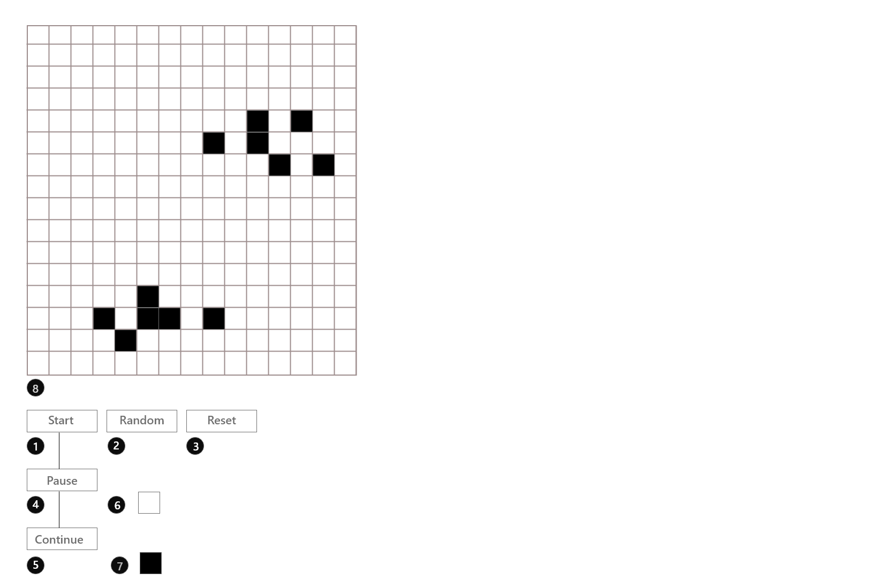

# Game Of Life
### Bit of description:

Game of Life also called the Conway's Game of Life is a [cellular automaton][5] 
 devised by [John Conway][4] a British Mathematician in the 70's.
 
Check down to the links for more details.

### Interesting Links:

* [Standford Detailed Page on Game of Life][1]
* [Amazing video on Game of Life][3]
* [Wikipedia Page on Cellular Automaton][5]
* [John Conway interesting interview][6]

### GOL Design with Legends

* ##### Annotations
1. The Start Button
2. The Random Button
3. The Reset Button
4. The Pause Button
5. The Continue Button
6. A Death Cell
7. A Living Cell
8. The Table (Which is where the representation of the generations will be taking place)

[//]: # (Standford detailed page of Game of Life reference link)
[1]:http://web.stanford.edu/~cdebs/GameOfLife/

[//]: # (Conway Game of Life Wikipedia reference link)
[2]:https://en.wikipedia.org/wiki/Conway%27s_Game_of_Life

[//]: # (Amazing Youtube video on Game of Life simulation reference link)
[3]:https://www.youtube.com/watch?v=C2vgICfQawE

[//]: # (John Conway Wikipedia reference link)
[4]:https://en.wikipedia.org/wiki/John_Horton_Conway

[//]: # (Cellular automaton Wikipedia reference link)
[5]:https://en.wikipedia.org/wiki/Cellular_automaton

[//]: # (John Conway cool interview)
[6]:https://www.youtube.com/watch?v=E8kUJL04ELA
